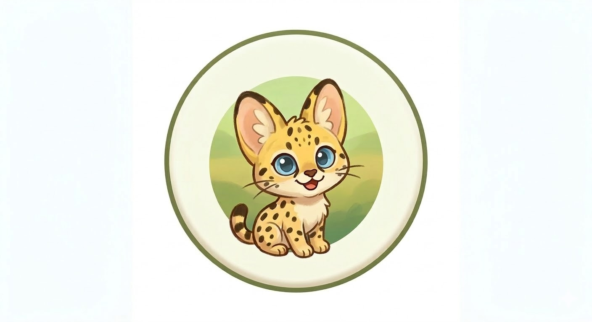

  
  <h1>Software Showcase</h1>
  
  

Welcome to my project site! I develop tools to optimize daily workflows and digital efficiency.

---

🚀 Projects

ClipX

"The fastest way to share your best moments."

An X (Twitter) specialized video editor designed for gamers. Optimized for creating high-quality highlight clips with minimal effort.

Status: ✅ Released

Platform: Windows 10 / 11

Features:

Auto-FFmpeg: Zero-config engine setup on first launch.

Hardware Acceleration: GPU-powered (NVENC/AMF/QSV) lightning-fast export.

Intuitive Workflow: Drag-and-drop merging & clip reordering.

Social Optimized: Aspect ratio adjustments and customizable text overlays.

Download: Latest Release

Right-Click to Share

"Share files instantly, directly from your shell."

A Windows shell extension that makes sharing files faster and easier via the context menu.

Status: ✅ Released

Platform: Windows 10 / 11

Features:

Shell Integration: Directly accessible from the Windows right-click menu.

Quick Sharing: Minimal clicks to send files to your destination.

Multi-file Support: Handles multiple files simultaneously for batch sharing.

Download: Latest Release

📬 Contact

Follow me on GitHub for updates!

☕ Support me on Ko-fi

my-projects is maintained by ServalC4t.
This page was generated by GitHub Pages.
